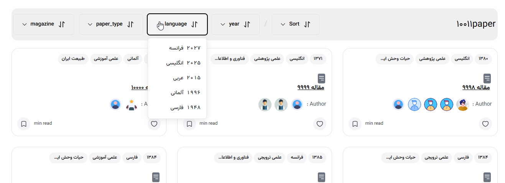
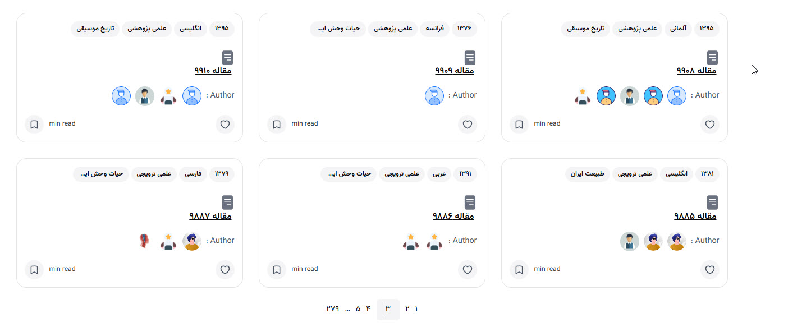

# Interactivity Docs

A WordPress plugin that powers a reactive, filterable documentation archive using the native **WordPress Interactivity API** — no React, no extra framework on the front end.

[](https://wordpress.org)
[](https://php.net)
[](https://www.gnu.org/licenses/gpl-2.0.html)

---

## Highlights

- **Reactive UI without a framework** — built on the WordPress Interactivity API (store, context, actions, callbacks). Zero front-end framework dependency.
- **Strategy-based filter pipeline** — `clientStrategy`, `serverStrategy`, `singlePageStrategy`, and `sortStrategy` swap at runtime; the view layer remains free of conditional branching.
- **Composable state layer** — state is split into focused getter modules (`composeState`, `layoutState`, `menuState`, `selectorState`, `sortState`, `uiState`), each with a single responsibility.
- **Repository + Sync architecture** — typed repositories (`BookRepository`, `PaperRepository`, `PersonRepository`, `RelationRepository`) behind interfaces, with a `SyncCoordinator` keeping post data and relations in sync.
- **Custom REST layer** — dedicated controller, routes, and config (`DocsController`, `DocsRoutes`, `ApiConfig`, `SortConfig`) power server-side filtering, sorting, and pagination.
- **ACF as code** — all field groups live in `acf-json/` and are version-controlled. Schema is in the repo, not the database.
- **Zero runtime Composer dependency** — a fallback PSR-4 autoloader runs when `vendor/` is absent, ensuring the distributed ZIP works standalone.

---

## Screenshots

The **Docs Archive** block in action — a fully reactive, framework-free UI built on the WordPress Interactivity API.

### Multilingual filters
Filter documents by taxonomy terms with instant, client-side updates.


### Card-based results
Responsive card layout that adapts to each post type (papers, books, people).



### Sorting
Sort results on the fly without a full page reload.



## Requirements

| Requirement | Version |
|---|---|
| WordPress | ≥ 6.5 |
| PHP | ≥ 8.0 |
| Advanced Custom Fields (ACF) | ≥ 6.0 (free or Pro) |

> WordPress 6.5+ handles the ACF dependency automatically via the `Requires Plugins: advanced-custom-fields` plugin header.

---

## Installation

### End-user (ZIP)
1. Download the latest `interactivity-docs.zip` from [Releases](https://github.com/hadimahoor/interactivity-docs/releases).
2. In WordPress admin, go to **Plugins → Add New → Upload Plugin**.
3. Upload the ZIP and click **Activate**.
4. Ensure **Advanced Custom Fields** is installed and active.

### Developer (Clone)
```bash
git clone https://github.com/hadimahoor/interactivity-docs.git wp-content/plugins/interactivity-docs
cd wp-content/plugins/interactivity-docs
composer install   # dev tools only (phpcs) — not needed at runtime
npm install
npm run build

---

## Architecture

text
interactivity-docs/
├── interactivity-docs.php          # Plugin bootstrap
├── composer.json / package.json
├── phpcs.xml.dist                  # PSR-12, line limit 180
├── acf-json/                       # Version-controlled ACF groups
├── build/                          # Compiled assets
├── src/
│   ├── BlockManager/               # Block registration
│   ├── Cli/                        # WP-CLI integration
│   │   ├── CliRegistrar.php
│   │   └── Commands/               # Sync, Schema, Verify commands
│   ├── Database/                   # Schema management
│   ├── Integration/                # ACF helpers
│   ├── Models/                     # Entity definitions (Book, Paper, Person)
│   ├── Repository/                 # Data access (Interface + Implementation)
│   ├── Rest/                       # REST API endpoints & configs
│   ├── Sync/                       # Data synchronization logic
│   └── blocks/                     # Interactivity API blocks
├── tests/                          # PHPUnit + Mockery suite
└── phpunit.xml.dist                # Testing configuration

---

## Advanced Features

### WP-CLI Integration
The plugin ships with robust WP-CLI commands for managing custom relational tables.

bash
# Sync supported post types (person → paper → book)
wp docs sync --all

# Sync a single post type
wp docs sync --post-type=book

# Sync specific posts by ID
wp docs sync --post-ids=123,456,789

# Dry run mode (preview without writing)
wp docs sync --all --dry-run

| Command | Purpose |
|---|---|
| `wp docs sync` | Sync posts into custom tables |
| `wp docs schema` | Manage custom table schema (create/drop/reset) |
| `wp docs verify` | Verify data integrity between sources |

### Quality Assurance
- **Unit tests** covering the Repository layer (CRUD, validation).
- **Mockery** used for isolating `$wpdb` and external dependencies.
- **PSR-4 + strict types** throughout, enabling clean dependency injection.
- **CI-ready** via automated Composer scripts.

---

## Development

| Command | Description |
|---|---|
| `composer install` | Install dev dependencies |
| `composer lint` | Run PHPCS (PSR-12) |
| `composer lint:fix` | Auto-fix with PHPCBF |
| `composer test` | Run PHPUnit suite |
| `composer test:coverage` | Generate coverage report |
| `npm run build` | Compile production assets |

---

## Key Design Decisions

- **Zero runtime Composer dependency** — a fallback PSR-4 autoloader in `Plugin.php` handles class loading when `vendor/` is absent.
- **Strategy pattern** — the filter strategy is selected at init; the pipeline calls a unified interface regardless of execution context (client, server, single-page, sort).
- **Repository + Factory** — `RepositoryFactory` resolves typed repositories behind shared interfaces, isolating data access from REST controllers.
- **Composable state** — each state getter module owns one concern and is combined in `composeState.js`.
- **ACF Local JSON** — field group schema lives in `acf-json/` and travels with the repo.

---

## License

[GPL-2.0-or-later](https://www.gnu.org/licenses/gpl-2.0.html)

*Built by [Hadi Khodayari](https://github.com/hadimahoor)*
